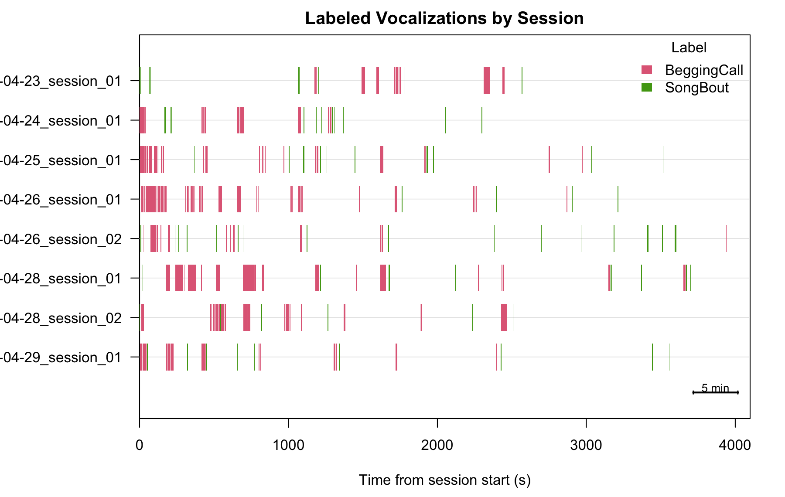
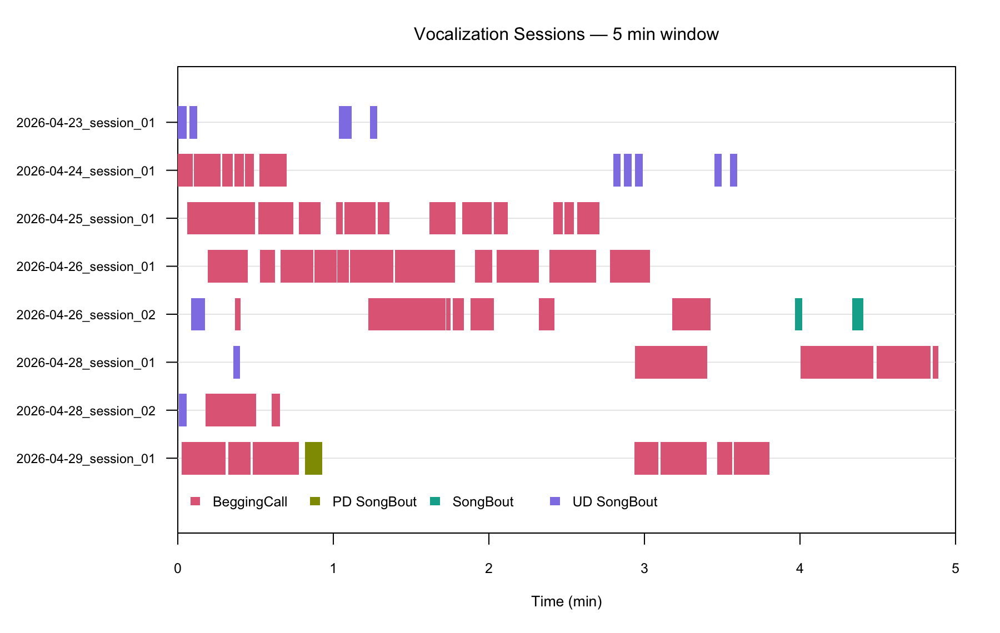
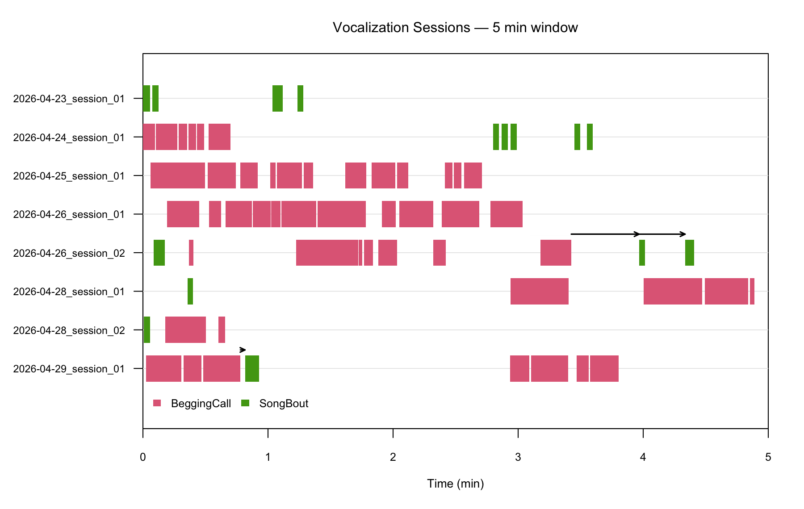

```{r setup, include = FALSE}
knitr::opts_chunk$set(
  collapse = TRUE,
  comment = "#>",
  fig.width = 10,
  fig.height = 5,
  out.width = "100%",
  eval = FALSE
)
```

## Introduction

**LYS** (Label Your Song) is an R package for recording management, session
assignment, and tracking the interaction of multiple vocal components across
behavioral experiments. It is designed for researchers who record birdsong
(or other vocalizations) across many sessions and need to automatically
detect, classify, and visualize different vocal types — such as song bouts
and begging calls — within the same continuous recording.

This tutorial walks through the complete LYS workflow using a zebra 
finch dataset spanning posthatch days 661–667. Along the way you
will see how to:

1. Explore a single WAV file and design vocalization templates interactively.
2. Pool recordings across sessions and create a LYS object for batch
   processing.
3. Detect general audio activity and run template-based vocalization
   detection.
4. Label detected clips using rule-based logic.
5. Visualize labeled vocalizations as a session ethogram and a sliding-window
   animation.

**Prerequisites**: LYS requires the [ASAP](https://github.com/LXiao06/ASAP)
package for spectrogram visualization and audio clipping.

```{r load_library, eval = FALSE}
library(LYS)
```

---

## Part 1 — Explore a Single WAV File

Before running the full batch pipeline it pays to inspect a few recordings
manually. LYS re-exports `visualize_song()` and `create_audio_clip()` from
ASAP, so you can work entirely within LYS.

### 1.1 Visualize a recording

```{r visualize_song}
data_root_dir <- "/path/to/your/data"   # <- change to your data directory

file_path <- file.path(data_root_dir, "661/G769_46135.58056615_4_23_16_7_36.wav")

visualize_song(file_path,
               start_time_in_second = 0,
               end_time_in_second   = 3)
```

### 1.2 Create a song template

Identify a clean song syllable in the spectrogram, clip that region, then
call `create_template()` on the clip. The template will be used later by
`detect_template()` as a correlation fingerprint.

```{r create_song_template}
# Trim to the region of interest first
clip_path <- create_audio_clip(file_path,
                               start_time = 0,
                               end_time   = 2.5)

# Build a correlation template from one song syllable
template_song <- create_template(
  clip_path,
  template_name = "song",
  start_time    = 0.45,
  end_time      = 0.70,
  freq_min      = 1,
  freq_max      = 8,
  write_template = TRUE   # saves a .rda file next to the clip
)
```

Run a quick sanity check on the same file:

```{r detect_single_song}
template_matches <- detect_template(
  x                = file_path,
  template         = template_song,
  proximity_window = 0.5,
  save_plot        = FALSE
)
```

### 1.3 Create a begging-call template

Repeat the process for begging calls. Here two representative call
exemplars are turned into separate templates and then run together.

```{r create_call_templates}
wav_file <- file.path(data_root_dir, "661/G769_46135.58036834_4_23_16_7_16.wav")

visualize_song(wav_file,
               start_time_in_second = 0,
               end_time_in_second   = 8)

clip_path1 <- create_audio_clip(wav_file,
                                start_time = 2,
                                end_time   = 6)

begging_1 <- create_template(
  clip_path1,
  template_name = "begging_1",
  start_time    = 0.50,
  end_time      = 0.75,
  freq_min      = 1,
  freq_max      = 12,
  write_template = TRUE
)

begging_2 <- create_template(
  clip_path1,
  template_name = "begging_2",
  start_time    = 1.63,
  end_time      = 1.83,
  freq_min      = 1,
  freq_max      = 12,
  write_template = TRUE
)

# Detect both call templates together
template_matches <- detect_template(
  x         = wav_file,
  template  = c(begging_1, begging_2),
  threshold = 0.4,
  save_plot = FALSE
)
```

> **Tuning tips for `create_template()` / `detect_template()`**
>
> | Parameter | Role | When to adjust |
> |---|---|---|
> | `start_time` / `end_time` | Time window of the template syllable | Narrow to a single clean, representative token |
> | `freq_min` / `freq_max` | Frequency band (kHz) for the correlation template | Match the call's dominant frequency range |
> | `threshold` | Minimum correlation score (0–1) to report a detection | Lower → more detections (more false positives); higher → fewer (more misses) |
> | `proximity_window` | Merge nearby peaks within this window (seconds) | Set to ≈ syllable duration to suppress duplicate hits |

---

## Part 2 — Batch Processing with a LYS Object

Once the template parameters look right on single files, pool your
recordings and create a `lys` object to process every session at once.

### 2.1 Create a LYS object

`create_lys_object()` scans a directory recursively, parses timestamps from
SAP-formatted filenames, and automatically groups consecutive recordings into
sessions separated by gaps longer than `session_gap_hours`.

```{r create_lys_object}
# Pool sessions 661–667 dph into one directory before calling this
pooled_sessions_path <- file.path(data_root_dir, "661/PD_661_667")

lys <- create_lys_object(
  base_path         = pooled_sessions_path,
  session_gap_hours = 1          # default; adjust to your experiment
)
```

After creation, print the object to see a summary:

```{r print_lys, eval = FALSE}
lys          # or: summary(lys)
```

```{r print_lys_output, echo = FALSE, eval = TRUE}
cat(
"LYS Object
==========
Base path: /path/to/PD_661_667
Recording days: 7
Sessions:       14
Files:          168
Detected vocalizations: 0
Template types: song_bout, innate_call, pupil_beg_call"
)
```

The object stores:

| Slot | Contents |
|---|---|
| `lys$metadata` | One row per WAV file with parsed timestamps, session IDs, and session labels |
| `lys$day_summary` | Counts of files and sessions per recording day |
| `lys$session_summary` | Start time, duration, and file count per session |
| `lys$templates` | Template registry (populated in §2.3) |
| `lys$vocalizations` | Detected and labeled clips (populated in §2.4–2.5) |

### 2.2 Locate the template source files

`get_wav_indices()` returns the row index in `lys$metadata` for a given
filename, which you need when telling `create_template.lys()` which file to
use as the template source.

```{r get_wav_indices}
song_index <- get_wav_indices(lys, "G769_46135.58056615_4_23_16_7_36.wav")
beg_index  <- get_wav_indices(lys, "G769_46135.58036834_4_23_16_7_16.wav")
```

### 2.3 Detect general audio activity

`detect_vocalization()` scans every WAV file for periods of elevated
RMS energy within a user-defined frequency band. Use multiple cores to
speed up large datasets.

```{r detect_vocalization}
lys <- detect_vocalization(lys, cores = 4)
```

> **Key parameters for `detect_vocalization()`**
>
> | Parameter | Role | Typical range |
> |---|---|---|
> | `freq_range` | Bandpass filter limits in kHz applied before RMS computation | `c(3, 5)` for zebra finch song |
> | `rms_threshold` | Normalized RMS threshold (0–1) above which audio is "active" | 0.1–0.3 |
> | `min_duration` | Minimum bout duration (s) to keep | 0.5–2 s |
> | `gap_duration` | Gaps shorter than this (s) are merged into one bout | 0.3–1 s |
> | `norm_method` | How the RMS envelope is scaled before thresholding (`"quantile"` or `"max"`) | `"quantile"` is more robust to occasional loud noises |

### 2.4 Register templates and run template detection

Register both the song and begging-call templates against the `lys` object,
using the same timing and frequency parameters that worked on the single file.
Then run `detect_template()` in batch mode.

```{r create_lys_templates}
lys <- create_template(
  lys,
  template_name = "song",
  template_type = "song_bout",
  index         = song_index,
  start_time    = 0.45,
  end_time      = 0.70,
  freq_min      = 1,
  freq_max      = 8,
  threshold     = 0.60
)

lys <- create_template(
  lys,
  template_name = "begging_2",
  template_type = "pupil_beg_call",
  index         = beg_index,
  start_time    = 3.63,      # times are relative to the clip, not the file
  end_time      = 3.83,
  freq_min      = 1,
  freq_max      = 12,
  threshold     = 0.55
)
```

```{r detect_lys_template}
lys <- detect_template(
  lys,
  template_name = c("song", "begging_2")
)
```

Results are accessible via `lys$templates$template_matches`.

---

## Part 3 — Label Vocalizations

`label_vocalization()` scores each detected audio clip against the template
match counts and applies a priority-ranked rule table.

### 3.1 Define labeling rules

```{r define_rules}
rules <- data.frame(
  template_type = c("song_bout", "pupil_beg_call"),
  label         = c("SongBout",  "BeggingCall"),
  min_matches   = c(1, 5),     # minimum template hits required inside a bout
  priority      = c(2, 1)      # lower number = higher priority when ties occur
)
```

| Column | Meaning |
|---|---|
| `template_type` | Must match an allowed type registered in the `lys` object |
| `label` | Human-readable label assigned when the rule fires |
| `min_matches` | Minimum number of template detections that must fall inside the bout |
| `priority` | When multiple rules fire, the row with the **lowest** priority number wins |

### 3.2 Run labeling

```{r label_vocalization}
lys <- label_vocalization(
  lys,
  rules = rules
)
```

Labeled results live in `lys$vocalizations$vocalization_label`.

### 3.3 Save and reload

```{r save_lys}
saveRDS(lys, file.path(data_root_dir, "lys_G769.rds"))
```

```{r load_lys}
lys <- readRDS(file.path(data_root_dir, "lys_G769.rds"))
```

### 3.4 Re-label individual files

After inspecting plots you may want to adjust the rules for specific files
without reprocessing the entire dataset.

```{r relabel_file}
new_rules <- data.frame(
  template_type = c("song_bout", "pupil_beg_call"),
  label         = c("SongBout",  "BeggingCall"),
  min_matches   = c(1, 5),
  priority      = c(1, 2)          # priorities swapped for this file
)

lys <- label_vocalization(
  lys,
  rules       = new_rules,
  multi_label = TRUE,              # allow compound labels (e.g. "SongBout;BeggingCall")
  files       = "G769_46136.49419826_4_24_13_43_39.wav",
  save_plot   = TRUE
)
```

---

## Part 4 — Export Vocalizations

Once vocalizations are detected and labeled, you may want to extract the individual audio clips from the source WAV files for downstream analyses (e.g., training a classifier, analyzing acoustic features, or manual verification).

The `export_vocalizations()` function extracts each labeled vocalization bout, applies optional padding, and saves it as a short WAV clip in a dedicated subdirectory.

### 4.1 Export compound/multi-label clips

When `multi_label = TRUE` is used (as in §3.4), some vocalization clips will receive compound labels like `"SongBout;BeggingCall"`. You can export these co-occurring events to their own folder:

```{r export_vocalizations, eval = FALSE}
# Define an export rule for compound labels
export_rules <- data.frame(
  label         = "SongBout;BeggingCall",
  match_mode    = "exact",         # only export exact matches of this compound label
  folder        = "co-occurring",  # folder name under output_dir
  pad_start_sec = 0.1,             # add 0.1s padding before onset
  pad_end_sec   = 0.1              # add 0.1s padding after offset
)

# Export the clips
lys <- export_vocalizations(
  lys,
  rules      = export_rules,
  output_dir = "vocalization_clips"
)
```

This will create a subdirectory structure like:
```text
vocalization_clips/
└── co-occurring/
    ├── G769_46136.49419826_4_24_13_43_39_s001_12040-13150ms.wav
    └── export_manifest.csv
```

A CSV manifest (`export_manifest.csv`) is automatically generated in the `output_dir` to log the source file, precise timing, and metadata for every exported clip.

---

## Part 5 — Visualize: Session Ethogram

`map_vocalization_sessions()` places every labeled vocalization on a timeline
relative to the start of its recording session, producing an ethogram-style
raster plot.

```{r map_sessions}
lys <- map_vocalization_sessions(
  lys,
  labels      = c("SongBout", "BeggingCall"),
  drop_labels = "TBD",
  save_plot   = TRUE
)
```

The resulting plot shows each session as a horizontal lane, with colored
rectangles indicating the onset and offset of each vocalization type:

```{r session_map_fig, echo = FALSE, eval = TRUE, out.width = "100%", fig.cap = "Session ethogram: SongBout (teal) and BeggingCall (orange) across seven recording sessions (PHD 661–667). Each horizontal lane represents one session; bar width encodes bout duration."}

```

> **How to read the plot**: Each row is one recording session (labeled on the
> y-axis by session ID). Colored rectangles mark vocalization bouts. Notice
> that BeggingCalls (orange) and SongBouts (teal) often occur in close
> temporal proximity — the animation in Part 6 reveals the fine-grained
> sequential structure.

---

## Part 6 — Visualize: Sliding-Window Animation

`animate_vocalization_sessions()` creates a GIF that scrolls a fixed-width
time window across every session simultaneously, making it easy to see
within-session dynamics and sequential vocal interactions.

### 6.1 Basic animation with sequence reclassification

`sequence_rules` allow you to visually reclassify a following vocal event
based on what immediately preceded it. Here, a SongBout that starts within
30 s of a BeggingCall end is relabeled `"PD SongBout"` (provisioning-directed)
and rendered in red.

```{r animate_basic}
pd_rules <- data.frame(
  preceding_label = c("BeggingCall", "PD SongBout", "BeggingCall"),
  following_label = c("SongBout",    "SongBout",    "SongBout"),
  min_gap_sec     = c(0,             0,             120),
  max_gap_sec     = c(30,            10,            Inf),
  annotation      = c("PD SongBout", "PD SongBout", "UD SongBout"),
  color           = "#E53935",
  show_arrow      = FALSE
)

lys <- animate_vocalization_sessions(
  lys,
  window_duration_min = 5,
  step_seconds        = 10,
  sequence_rules      = pd_rules
)
```

```{r anim_fig, echo = FALSE, eval = TRUE, out.width = "100%", fig.cap = "Sliding-window animation (5-min window, 10-s step). SongBouts that follow a BeggingCall within 30 s are highlighted in red (PD SongBout). The animation scrolls through the full duration of every session in lockstep."}

```

### 6.2 Revised animation — with gap arrows and session cap

This variant adds directional arrows spanning the gap between a BeggingCall
and the SongBout it preceded, making the latency visually explicit. The
`max_session_sec = 3600` argument caps every session at 1 hour so the
animation does not scroll excessively.

```{r animate_revised}
arrow_only_rule <- data.frame(
  preceding_label = "BeggingCall",
  following_label = "SongBout",
  min_gap_sec     = 0,
  max_gap_sec     = 60,
  annotation      = "SongBout",  # same as following_label: no color change, only arrow
  show_arrow      = TRUE
)

lys <- animate_vocalization_sessions(
  lys,
  window_duration_min = 5,
  step_seconds        = 10,
  max_session_sec     = 3600,    # cap all sessions at 1 hour
  sequence_rules      = arrow_only_rule,
  output_file         = "vocalization_session_animation_revised.gif"
)
```

```{r anim_revised_fig, echo = FALSE, eval = TRUE, out.width = "100%", fig.cap = "Revised animation with gap arrows. Black arrows span the gap between a BeggingCall end and the SongBout onset that follows within 60 s. The session is capped at 1 hour for display."}

```

> **Key parameters for `animate_vocalization_sessions()`**
>
> | Parameter | Role | Typical range |
> |---|---|---|
> | `window_duration_min` | Width of the sliding display window | 5–30 min |
> | `step_seconds` | How far the window advances per frame | 10–60 s |
> | `max_session_sec` | Hard cap on session duration (seconds); `NULL` = shortest session | 1800–7200 |
> | `fps` | Frames per second of the output GIF | 8–15 |
> | `sequence_rules` | Data frame defining reclassification / arrow rules | see §6.1 |

---

## Summary

The table below maps the complete LYS workflow to the functions introduced in
this tutorial:

| Step | Function | Output |
|---|---|---|
| Inspect recording | `visualize_song()` | Spectrogram plot |
| Clip audio | `create_audio_clip()` | Trimmed WAV file |
| Build template (file) | `create_template(<wav_path>, ...)` | `TemplateList` object |
| Build template (lys) | `create_template(<lys>, ...)` | Updated `lys` |
| Detect audio activity | `detect_vocalization(lys)` | `lys$vocalizations` |
| Template-match detection | `detect_template(lys)` | `lys$templates$template_matches` |
| Rule-based labeling | `label_vocalization(lys, rules)` | `lys$vocalizations$vocalization_label` |
| Export audio clips | `export_vocalizations(lys, rules)` | Directory of WAV files + CSV manifest |
| Session ethogram | `map_vocalization_sessions(lys)` | PNG + `lys$vocalization_session_map` |
| Sliding-window animation | `animate_vocalization_sessions(lys)` | GIF file |

Save the `lys` object with `saveRDS()` after each major step and reload it
with `readRDS()` to resume from where you left off without rerunning
expensive computations.

